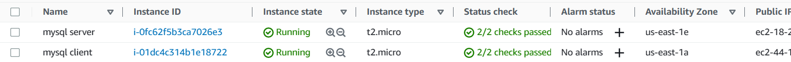
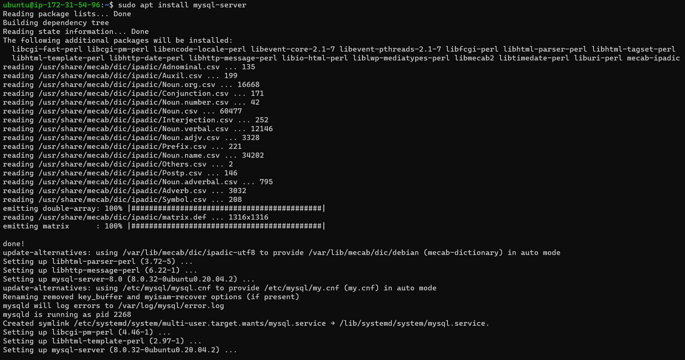
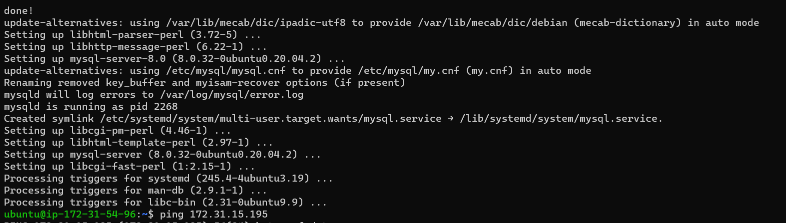
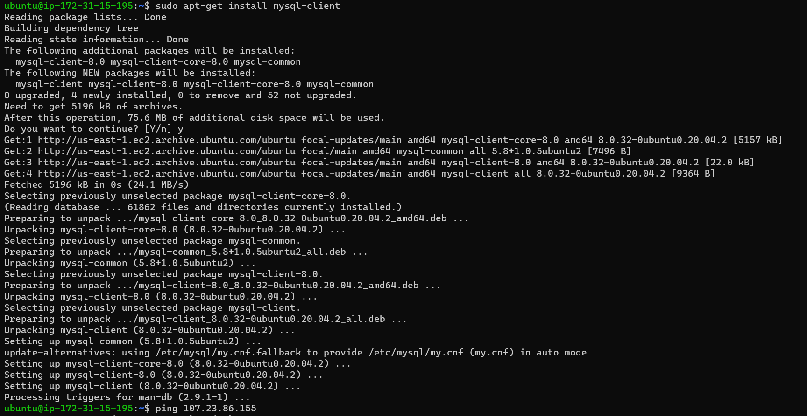
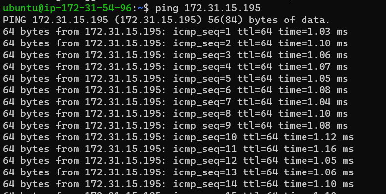
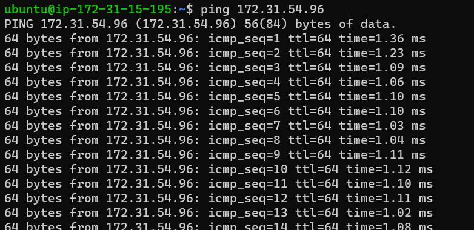

# IMPLEMENT A CLIENT SERVER ARCHITECTURE USING MYSQL DATABASE MANAGEMENT SYSTEM (DBMS)

## To Implement a Client Server Architecture using MySQL Database Management System (DBMS)

### To demonstrate a basic client-server using MySQL Relational Database Management System (RDBMS):

### To create and configure two Linux-based virtual servers (EC2 instances in AWS)

```
Server A name - `mysql server`
Server B name - `mysql client`
```


### Installing  MySQL Server software on mysql server Linux

`sudo apt install mysql-server`





### Installing  MySQL Server software on mysql server Linux

`sudo apt-get install mysql-client`



### By default, both EC2 virtual servers are located in the same local virtual network, so they can communicate to each other using local IP addresses. 

### Using mysql server's local IP address to connect from mysql client, and vice versa.



