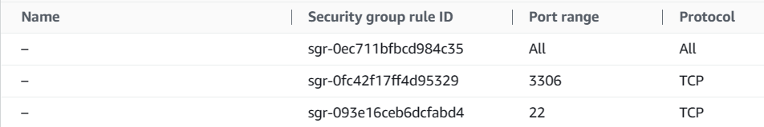

# IMPLEMENT A CLIENT SERVER ARCHITECTURE USING MYSQL DATABASE MANAGEMENT SYSTEM (DBMS)

## To Implement a Client Server Architecture using MySQL Database Management System (DBMS)

### To demonstrate a basic client-server using MySQL Relational Database Management System (RDBMS):

### To create and configure two Linux-based virtual servers (EC2 instances in AWS)

```
Server A name - `mysql server`
Server B name - `mysql client`
```


### Installing  MySQL Server software on mysql server Linux

`sudo apt install mysql-server`


### Installing  MySQL Server software on mysql server Linux

`sudo apt-get install mysql-client`


### MySQL server uses TCP port 3306 by default, so, port 3306 will be opened by creating a new entry in ‘Inbound rules’ in ‘mysql server’ Security Groups. 


### By default, both EC2 virtual servers are located in the same local virtual network, so they can communicate to each other using local IP addresses. 

### Using mysql server's local IP address to connect from mysql client, and vice versa.


### configuring MySQL server to allow connections from remote hosts.

`sudo vi /etc/mysql/mysql.conf.d/mysqld.cnf`


### Replacing ‘127.0.0.1’ to ‘0.0.0.0’


### apply changes made to the mysql config file by restarting the mysql service

`sudo systemctl restart mysql`


### Using the mysql utility to connect remotely from mysql client Linux Server to mysql server Database Engine (without using SSH).
### signing on mysql root user

### Setting up mysql root user
`ALTER USER 'root'@'localhost' IDENTIFIED WITH mysql_native_password BY 'PassWord.1';`


`CREATE DATABASE mysqlDB;`


`Show databases;`


`USE mysqlDB;`


### Setting up mysql user 'derick' (root user from mysql client)

`CREATE USER derick@172.31.15.195 IDENTIFIED BY '*********'; GRANT ALL PRIVILEGES ON mysqlDB.* TO derick@172.31.15.195;`


### To show privivleges granted to mysql user

`SHOW GRANTS FOR derick@172.31.15.195;`


### Connecting remotely from mysql client to mysql server Database Engine without using the mysql utility

`mysql -u derick -h 172.31.54.96 -p`


### Executing 'Show databases;' with remote connection to mysql server

`Show databases;`


# Project Implemented Successfully